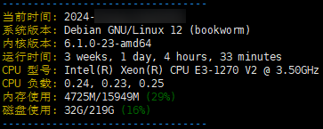

# SSH 登录时显示系统信息



### 使用方法

用 root 登录，执行

```Bash
cd /etc/profile.d/ && wget https://raw.githubusercontent.com/yuanze31/sysinfo-in-ssh-login/refs/heads/main/sysinfo.sh
```

**此脚本已在 Debian 11 和 Debian 12 上测试可用**
